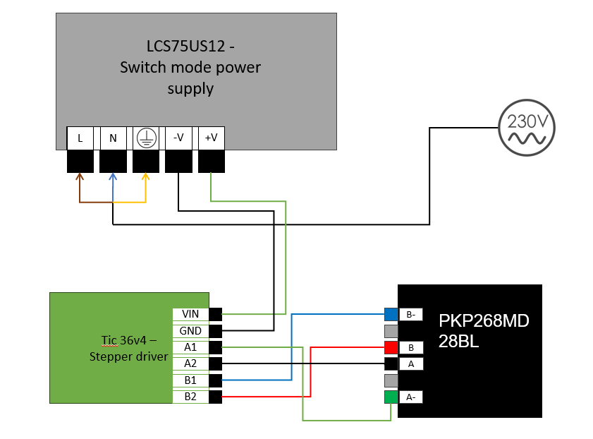

# ***Stepper CBK***

## Introduction 
The main goal of the experiment is to convert linear motion into rotational motion. It will be used in a vacuum chamber.  
Correct connection between used tools will allow us to control movement device which we will be measured. In our case it is
GLOWS.  
This solution will save us time and let control possibility of turnover in a vacuum chamber. 
The program controls stepper motor via Arduino. It asks about two positions, current and target.  
Then calculates the precise distance and waiting time. After that the stepper motor drives to target position.   
The velocity grows gradually (100 steps/second to 500 steps/second).  
It means that from 0 to 5 second the motor gains velocity and after 5 seconds the stepper moves with the same speed.

## Included devices:
- Actuator - LD 40-500 S2 SL + customized support tube
- Stepper motor - PKP 268MD28BL
- Arduino Leonardo
- Stepper driver - Tic 36v4
- Switch mode power supply - LCS75US12
- 2x Limit Switch - MZX1 361 306
- LCD screen (20, 4)
- USB cable
- Connecting wires

## Calculations
- The program calculate the change (mm) as a difference between 'target_pos' and 'current_pos'.
    > zmiana = zadana_pos - obecna_pos;

- The program calculate the distance (steps). 
    > odl = zmiana * 2 / 3 * 100.  

    *You have to multiply 'change' by 2 / 3 and 100. The result will be correct (2/3 because 600 steps equals 9 mm).  

- The program calculate the time waiting (ms) while we wait for stepper to achieve target position.
    > czekanie = (abs(odl)) * 4 + 5000.

    *abs - the absolute value, 5000 (ms) it is time to achieve max speed by the motor, '*4' because of Microsteps.     

## Scheme connection

## **Another Connection**

There is also more pins to connect which are not on shown on the figure.
Here are the others: 

### - Connection between Tic driver and Arduino Leonardo:
    - SCL --> SCL (red wire)
    - SDA --> SDA (white wire)
    - GND --> GND (black wire)
    - TX  --> RX  (grey wire)
    - RX  --> TX  (purple wire)
    - 5V  --> 5V  (red wire)

### - Connection between Limit Switch and Arduino Leonardo/Breadboard:
    1. Limit Switch:
    - NC --> 2 (blue && brown wire)
    - C  --> GND (blue && purple wire) - Breadboard
    2. Limit Switch:
    - NC --> 7      (white && grey wire)
    - C  --> GND  (white && orange wire) - Breadboard

### - Connection between LCD and Arduino Leonardo/Breadboard/Potentiometer:
    1.  - VSS --> GND (black wire) - Breadboard
    2.  - VDD --> 5V (red wire) - Breadboard
    3.  - VO --> Output (green wire) - Potentiometer
    4.  - RS --> 12 (blue && blue wire)
    5.  - RW --> GND (black wire) - Breadboard
    6.  - E --> 11 (blue && purple wire)
    11. - DB2 --> 6 (orange && orange wire)
    12. - DB5 --> 5 (orange && yellow wire)
    13. - DB6 --> 4 (orange && yellow wire)
    14. - DB7 --> 3 (orange && orange wire)
    15. - LED A --> 5V (red wire) - Breadboard
    16. - LED K --> GND (black wire) - Breadboard

### - Connection between Potentiometer and Breadboard:
    - Supply (Vs) --> 5V (brown wire) - Breadboard
    - Output (Vout) --> V0 (green wire) - LCD
    - Ground (Vg) --> GND (white wire) - Breadboard

### - Connection between Breadboard and Arduino Leonardo:
    - 5V (+)  --> 5V (red wire) 
    - GND (-) --> GND (brown wire) 

### - Connection between USB Port and Arduino Leonardo:
    - USB cable (Micro USB) 

# *Instruction - Control of the Stepper Motor*

If all devices are connected correctly and there is power. The next step is to run the program.  
The program asks about current position and target position. ***You have to type it correctly in millimeters.***  
The range of motion in the actuator is between 0 and 500 mm. If you type less than 0 or more than 500, the program will ask you agaian to type the position but do it this correctly.  
***Don't rush while the stepper is moving.*** When the stepper reaches the target position, it must wait for a certain period of time. Then it will ask you again about the position.

If either of Limit Switch was touched the stepper motor should stop instantly, after that it will  ask you about the position.  
For a safety it is better to enter such a position so that it drives away from the Limit Switch to a safe distance.  
- For Example The Limit Switch is at the 496mm:
1. The entered current position: "470".
2. The entered target position: "500".
3. The Stepper drives to position 500.
4. It stops instantly if the Limit Switch is touched and Hold position at 496mm.
5. The entered current position: "496".
6. The entered target position: "485".   
***(You must not entered a position greater than the current position when the limit Switch is touched or smaller than the current position when the other limit Switch is touched)***

Controlling stepper motor is via Serial Port, so on the Serial screen there will be shown all information you need as a current and target position, change of position (mm), change distance (steps), and which direction should the stepper move ("LEWO" / "PRAWO").

### **WATCH OUT**

Things you should pay attention:

- You have to type the position between (0 - 500).  
- Watch out for putting the incorrect position.  
- If the position you put is not from the scope and either of Limit Switch was touched the stepper motor should stop instantly.
- If the limit Switch is touched think which direction should go next
